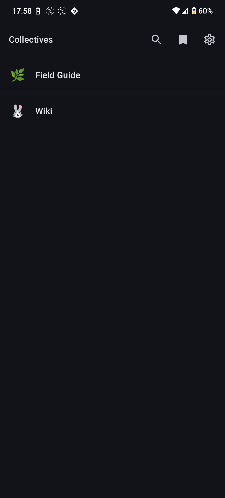
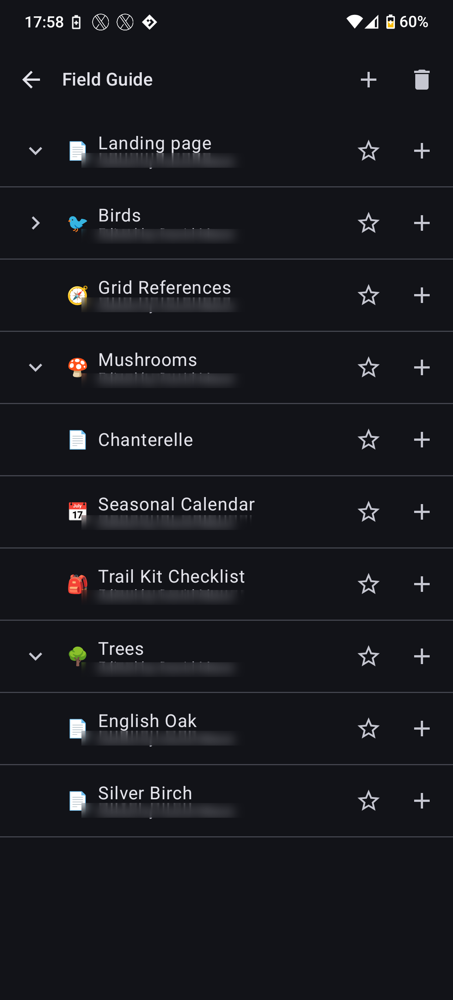
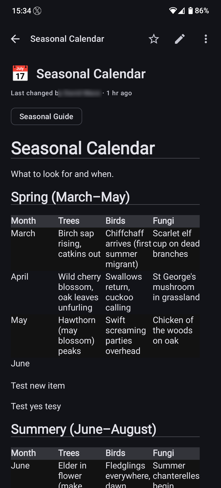
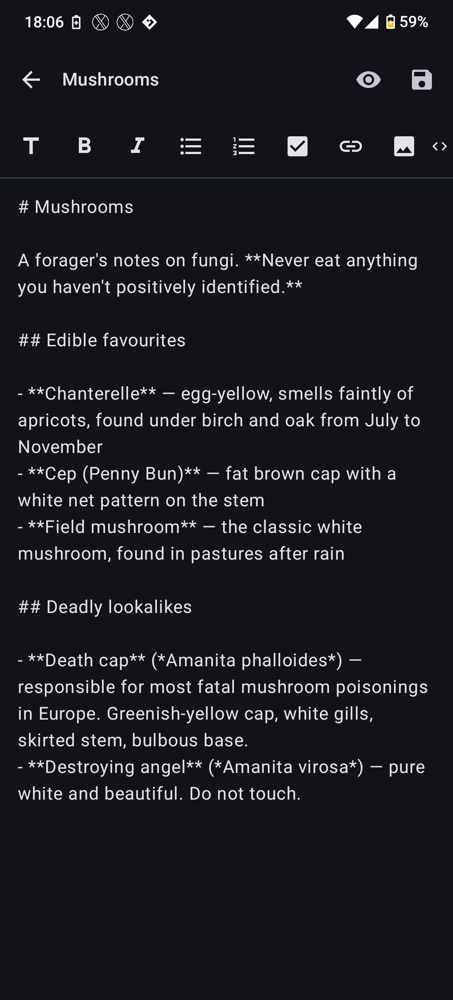
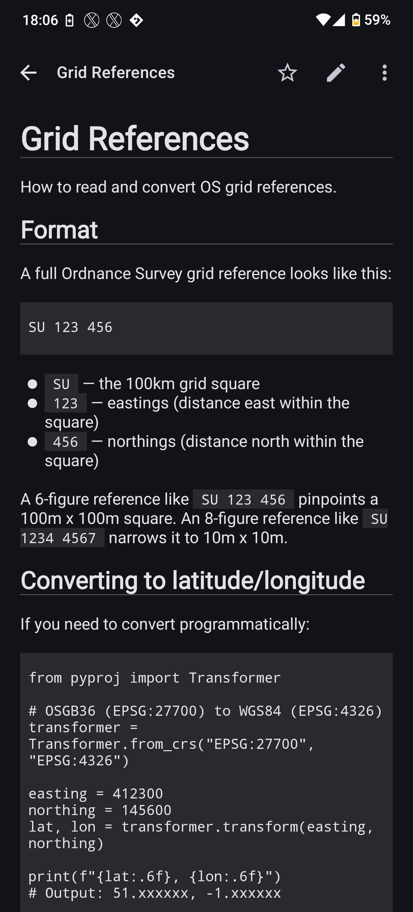

# NC Collectives — Android

An unofficial native Android client for the [Nextcloud Collectives](https://github.com/nextcloud/collectives) app — wiki-style markdown notebooks hosted on your own Nextcloud server.

> **100 % AI-written.** Every line of source, every test, every CI workflow, this README, and almost every commit message in this repository was written by [Claude Code](https://www.anthropic.com/claude-code) under direction from a human reviewer. No code in this repository was hand-typed.

> **Unofficial.** This project is not affiliated with, endorsed by, or supported by Nextcloud GmbH or the Nextcloud Collectives team. "Nextcloud" and "Collectives" are trademarks of their respective owners.

## Screenshots

<p align="center">
  
  
  
</p>
<p align="center">
  
  
</p>

## Features

- Browse collectives and nested page trees
- Render markdown pages, including images, links, task lists, tables, fenced code blocks, Nextcloud Text callouts (`> [!INFO]` / `[!WARN]` / `[!ERROR]` / `[!SUCCESS]`), and `==text==` highlights
- View-first by default with a per-page edit toggle. Two editors ship side-by-side: a **collaborative WebView editor** backed by [Nextcloud Text](https://github.com/nextcloud/text) (multi-user real-time editing, callouts, multi-line tables, math, etc.) used when the server supports it, and a **native markdown editor** with formatting toolbar + live preview swap that works offline. Choose the default under **Settings → Editor** (Auto / Always plain / Always collaborative).
- Offline read cache and offline edit queue (last-write-wins on conflict; local edits preserved as drafts attached to the page)
- Full-text search via the Nextcloud unified-search provider
- Favourites and recent searches, persisted across sessions
- Per-page tags, emoji, rename, and move (folder pages supported)
- Attachments: view inline images, upload from camera or gallery
- Trash + restore, with pre-commit undo on a snackbar
- Share-intent quick capture from any app (text, URLs, single or multiple images)
- Backlinks: collapsible "linked from" row under every page that shows which other pages reference it
- Wikilink support: `[[Page Name]]` and relative `.md` links resolve in-app
- Light, Dark, or System theme; Material 3 styling
- Configurable background sync cadence (Off, 1h, 6h, 12h, daily)
- Adaptive launcher icon with a monochrome layer for Android 13+ themed icons
- Splash screen via `androidx.core:core-splashscreen`
- In-app update check: on startup, polls the GitHub Releases API at most once per 24 hours and posts a notification when a newer version is published. Tapping the notification opens the release page in your browser. Distribution is sideload-only, so this is how you hear about updates.

## Requirements

- Android 10 (API 29) or newer
- A Nextcloud instance with the [Collectives app](https://apps.nextcloud.com/apps/collectives) installed and accessible to your account, served over HTTPS

## Installing

1. Download the latest `app-release.apk` from the [Releases](https://github.com/megamaced/nc_collectives_android/releases) page.
2. On the phone, allow the browser (or the file manager you opened the APK with) to install apps. Android usually prompts the first time; the toggle also lives under **Settings → Apps → Special app access → Install unknown apps**.
3. Tap the downloaded APK to install. Android will surface the Play Protect scanning prompt — it can flag unrecognised installers but the install itself is safe to proceed with.
4. Open the app, paste your Nextcloud server URL (e.g. `https://cloud.example.com`), and approve the device in the browser tab that opens. The device-scoped app password is stored in encrypted shared preferences; your real account password is never seen by the app.

### Updates

The app checks `api.github.com/repos/megamaced/nc_collectives_android/releases/latest` at most once every 24 hours on launch and posts a notification when a newer non-pre-release tag is available. Tap the notification to open the release page in your browser and download the new APK; install it over the existing app (same signing key from `v1.0.0` onwards, so it's an in-place upgrade). No notification is shown if the request fails, if you're already on the latest version, or if you've already been notified about that tag. On Android 13+ the notification needs `POST_NOTIFICATIONS` granted to your app under **Settings → Apps → NC Collectives → Notifications**.

## Authentication

Login uses the standard Nextcloud [Login Flow v2](https://docs.nextcloud.com/server/latest/developer_manual/client_apis/LoginFlow/index.html#login-flow-v2). You provide your server URL and authorise the app from your browser. The app stores only the device-scoped app password returned by your server — your account password is never seen, transmitted, or stored. You can revoke the device at any time from your Nextcloud security settings.

## Privacy & security

- The app talks **only** to the Nextcloud server you configure, plus one third-party request to `api.github.com` on launch (at most once per 24 hours) for the in-app update check. The GitHub call uses a separate OkHttp client so it never carries your Nextcloud credentials. There are no analytics endpoints, no telemetry, no crash reporters, no third-party SDKs that phone home. The release APK has been confirmed clean of any `com.google.android.gms` or `com.google.firebase` classes.
- No Google Play Services dependencies; no Firebase; no advertising IDs.
- Plaintext (`http://`) Nextcloud server URLs are refused at login; the app ships with `cleartextTrafficPermitted="false"` in the network-security config.
- The device-scoped app password is stored in `EncryptedSharedPreferences` (Tink-backed). Sign-out wipes the keystore entry along with every Room table and DataStore value.
- Network requests trust the system certificate store. There is no certificate pinning yet — if your Nextcloud server uses a self-signed CA you'll need to install that CA on your device.

## Tech stack

- Kotlin 2.x + Jetpack Compose + Material 3 (single-Activity, type-safe Compose Navigation)
- Hilt for dependency injection
- Retrofit 3 + OkHttp 5 + kotlinx.serialization (OCS REST + WebDAV against one shared authenticated OkHttp client)
- Room 2.8 for the offline cache, edit queue, and attachment upload queue
- WorkManager for background sync and queued-edit / attachment-upload flush
- Coil 3 for image loading (reuses the authenticated OkHttp client via a `SingletonImageLoader.Factory`)
- Markwon for markdown rendering — themed directly against the M3 colour scheme via `AndroidView`
- Tink (`androidx.security:security-crypto`) for the encrypted credential store
- `androidx.core:core-splashscreen` for the launcher splash
- The system camera intent (via a scoped FileProvider) for in-app photo capture — no CAMERA permission

## Building

```bash
./gradlew assembleDebug
```

Debug APK lands at `app/build/outputs/apk/debug/app-debug.apk`.

For a release build:

```bash
./gradlew assembleRelease
```

Without signing env vars set, this produces an *unsigned* APK at `app/build/outputs/apk/release/app-release-unsigned.apk`. The signing setup (keystore generation, GitHub Actions secret names, local env vars) is documented in [`docs/SIGNING.md`](docs/SIGNING.md).

R8 minification is on for release builds and the output is deterministic — two consecutive `assembleRelease` runs at the same commit produce byte-identical APKs (matching SHA-256). Release builds are around 4.4 MB; debug builds, which include the full debug tooling, are around 73 MB.

## Contributing

Issues and pull requests welcome. For larger changes, please open an issue first.

## License

[AGPL-3.0-or-later](LICENSE) — same family as Nextcloud server and the Collectives app.
