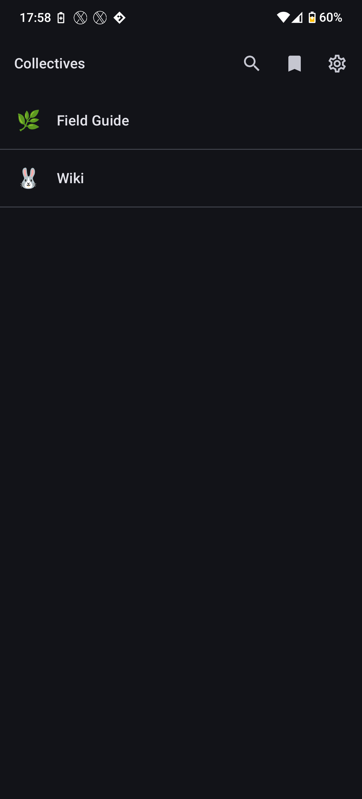
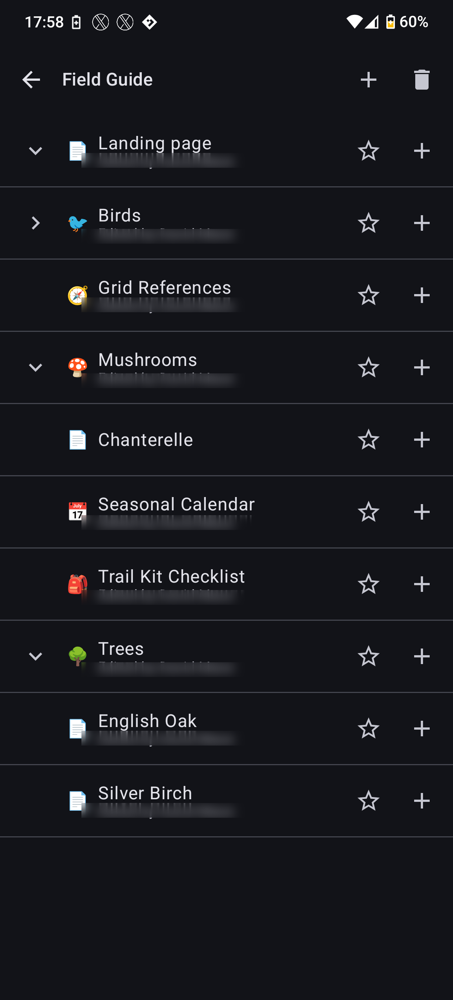
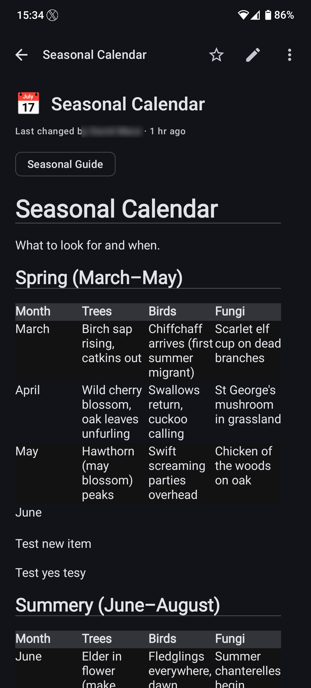
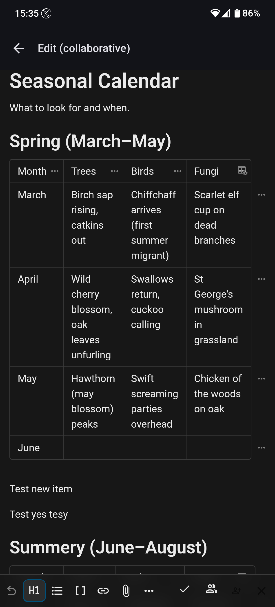
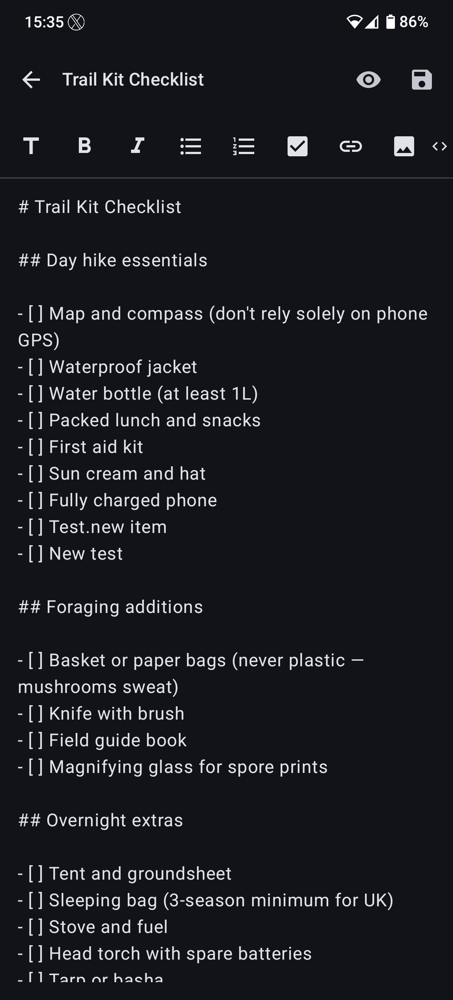
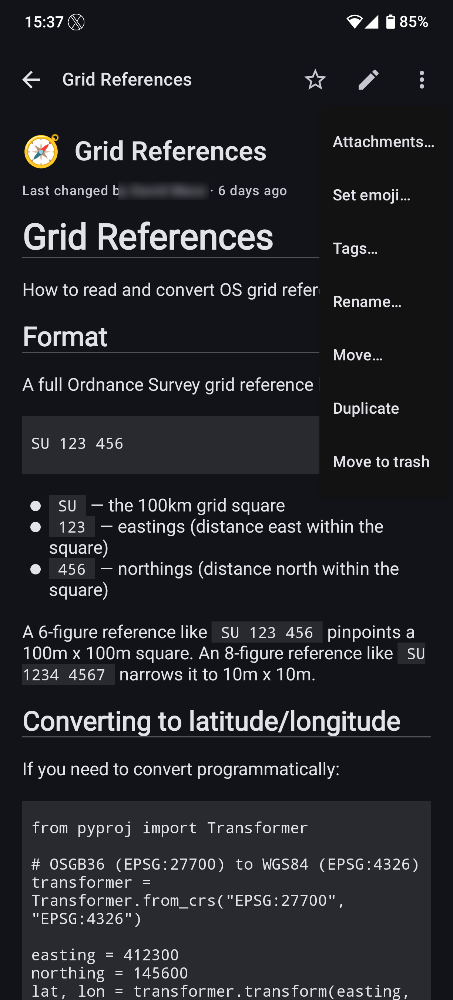

# NC Collectives — Android

An unofficial native Android client for the [Nextcloud Collectives](https://github.com/nextcloud/collectives) app — wiki-style markdown notebooks hosted on your own Nextcloud server.

> **100 % AI-written.** Every line of source, every test, every CI workflow, this README, and almost every commit message in this repository was written by [Claude Code](https://www.anthropic.com/claude-code) under direction from a human reviewer. No code in this repository was hand-typed.

> **Unofficial.** This project is not affiliated with, endorsed by, or supported by Nextcloud GmbH or the Nextcloud Collectives team. "Nextcloud" and "Collectives" are trademarks of their respective owners.

## Screenshots

<p align="center">
  
  
  
</p>
<p align="center">
  
  
  
</p>

## Features

- Multiple Nextcloud accounts, switched from **Settings → Accounts** without signing out. One account's pages are cached at a time — switching clears the previous account's local copy and downloads the new one's, and warns first if any edits haven't reached the server yet
- Browse collectives and nested page trees
- Render markdown pages, including images, links, task lists, tables, syntax-highlighted fenced code blocks (Prism4j, themed against the app's M3 colour scheme), Nextcloud Text callouts (`> [!INFO]` / `[!WARN]` / `[!ERROR]` / `[!SUCCESS]`), and `==text==` highlights
- View-first by default with a per-page edit toggle. Two editors ship side-by-side: a **native markdown editor** with formatting toolbar + live preview swap that works offline (default), and a **collaborative WebView editor** backed by [Nextcloud Text](https://github.com/nextcloud/text) (beta — multi-user real-time editing, callouts, multi-line tables, math, etc.) used when the server supports it and you're online. Choose the default under **Settings → Editor** (Prefer plain markdown / Prefer collaborative).
- Offline read cache and offline edit queue. A queued edit is sent with the ETag it was written against, so a page someone else changed meanwhile surfaces as a conflict rather than overwriting them — your text is kept as a draft on the page, beside theirs, and you choose which wins
- Full-text search via the Nextcloud unified-search provider
- Favourites and recent searches, persisted across sessions
- Per-page tags, emoji, rename, and move (folder pages supported)
- Long-press to drag pages and reorder them within their parent — same `subpageOrder` the web Collectives UI uses
- Attachments: view inline images, upload from camera or gallery
- Trash + restore, with pre-commit undo on a snackbar
- Share-intent quick capture from any app (text, URLs, single or multiple images)
- Page index: a heading list in the page toolbar, indented by level, that scrolls straight to the section you tap
- Backlinks: collapsible "linked from" row under every page that shows which other pages reference it
- Wikilink support: `[[Page Name]]` and relative `.md` links resolve in-app
- Light, Dark, or System theme; Material 3 styling
- Page text size (Small / Default / Large / Larger) under **Settings → Appearance**, applied to rendered pages, the native editor, and the collaborative editor from one setting. It multiplies your device's font-size setting rather than replacing it, so the two stack
- Configurable background sync cadence (Off, 1h, 6h, 12h, daily), plus pull-to-refresh on the collective list, page tree, page view, and attachments, and a "Sync now" button in Settings that reports when sync last succeeded or why it failed
- Pages revalidate their content against the server on open (`If-None-Match`, so an unchanged page costs a 304), which is what keeps edits made elsewhere from staying invisible
- Adaptive launcher icon with a monochrome layer for Android 13+ themed icons
- Splash screen via `androidx.core:core-splashscreen`
- Manual update check under **Settings → About → Check for updates**: queries the GitHub Releases API only when you tap it, and opens the release page in your browser if a newer version is out. Nothing is checked at launch or in the background, and the result is shown in the app rather than as a notification.

## Requirements

- Android 10 (API 29) or newer
- A Nextcloud instance with the [Collectives app](https://apps.nextcloud.com/apps/collectives) installed and accessible to your account, served over HTTPS

## Installing

### F-Droid (recommended)

[](https://f-droid.org/packages/com.megamaced.nccollectives/)

The app is published on F-Droid as `com.megamaced.nccollectives`. This is the route most people want: the F-Droid client notices new releases and updates the app for you, so you never have to come back here to find out a version shipped. Install the [F-Droid client](https://f-droid.org), search for **NC Collectives**, and install from there.

The listing is a **reproducible build**. F-Droid rebuilds the app from this repository at the release tag, verifies that the result matches the APK signed with the developer's key, and then distributes that same signed APK. Both channels therefore carry the same signature, which means you can move between the F-Droid build and a GitHub-release APK in either direction **without uninstalling** — either way it's an in-place upgrade that keeps your account and cached pages.

### APK from GitHub Releases

Still a supported route, and it's the exact build F-Droid reproduces. Use it if you'd rather not run the F-Droid client, or to get a release before F-Droid's scanner has picked it up — the trade-off is that nothing updates the app for you afterwards.

1. Download the latest `app-release.apk` from the [Releases](https://github.com/megamaced/nc_collectives_android/releases) page.
2. On the phone, allow the browser (or the file manager you opened the APK with) to install apps. Android usually prompts the first time; the toggle also lives under **Settings → Apps → Special app access → Install unknown apps**.
3. Tap the downloaded APK to install. Android will surface the Play Protect scanning prompt — it can flag unrecognised installers but the install itself is safe to proceed with.

### First run

Whichever route you used: open the app, paste your Nextcloud server URL (e.g. `https://cloud.example.com`), and approve the device in the browser tab that opens. The device-scoped app password is stored in encrypted shared preferences; your real account password is never seen by the app.

### Updates

If you installed from F-Droid, updates come through F-Droid — there's nothing to do in the app.

For sideloaded installs, update checks are user-initiated only. **Settings → About → Check for updates** queries `api.github.com/repos/megamaced/nc_collectives_android/releases/latest` at the moment you tap it, then either opens the release page in a browser tab (newer non-pre-release tag available) or reports via a snackbar that you're on the latest version or that GitHub couldn't be reached. Download the new APK from the page it opens and install it over the existing app — same signing key from `v1.0.0` onwards, so it's an in-place upgrade.

The app makes no launch-time or background request to GitHub, and it posts no notifications: results appear in the Settings screen, so no `POST_NOTIFICATIONS` permission is declared or needed.

## Authentication

Login uses the standard Nextcloud [Login Flow v2](https://docs.nextcloud.com/server/latest/developer_manual/client_apis/LoginFlow/index.html#login-flow-v2). You provide your server URL and authorise the app from your browser. The app stores only the device-scoped app password returned by your server — your account password is never seen, transmitted, or stored. You can revoke the device at any time from your Nextcloud security settings.

## Privacy & security

- The app talks **only** to the Nextcloud server you configure. The single third-party request — `api.github.com`, for the update check — is made when you tap **Check for updates** in Settings and at no other time; there is no launch-time or background call to GitHub. That call uses a separate OkHttp client so it never carries your Nextcloud credentials. There are no analytics endpoints, no telemetry, no crash reporters, no third-party SDKs that phone home. The release APK has been confirmed clean of any `com.google.android.gms` or `com.google.firebase` classes.
- No Google Play Services dependencies; no Firebase; no advertising IDs.
- Plaintext (`http://`) Nextcloud server URLs are refused at login; the app ships with `cleartextTrafficPermitted="false"` in the network-security config.
- The device-scoped app password is stored in `EncryptedSharedPreferences` (Tink-backed). Sign-out wipes the keystore entry along with every Room table and DataStore value.
- Network requests trust the system certificate store. There is no certificate pinning yet — if your Nextcloud server uses a self-signed CA you'll need to install that CA on your device.

## Tech stack

- Kotlin 2.x + Jetpack Compose + Material 3 (single-Activity, type-safe Compose Navigation)
- Hilt for dependency injection
- Retrofit 3 + OkHttp 5 + kotlinx.serialization (OCS REST + WebDAV against one shared authenticated OkHttp client)
- Room 2.8 for the offline cache, edit queue, and attachment upload queue
- WorkManager for background sync and queued-edit / attachment-upload flush
- Coil 3 for image loading (reuses the authenticated OkHttp client via a `SingletonImageLoader.Factory`)
- Markwon for markdown rendering (with Prism4j for syntax-highlighted code blocks) — themed directly against the M3 colour scheme via `AndroidView`
- System `WebView` + `androidx.webkit` (`WebSettingsCompat`) for the beta collaborative editor against the Nextcloud Text `directEditing` OCS endpoint
- Tink (`androidx.security:security-crypto`) for the encrypted credential store
- `androidx.core:core-splashscreen` for the launcher splash
- The system camera intent (via a scoped FileProvider) for in-app photo capture — no CAMERA permission

## Building

```bash
./gradlew assembleDebug
```

Debug APK lands at `app/build/outputs/apk/debug/app-debug.apk`.

For a release build:

```bash
./gradlew assembleRelease
```

Without signing env vars set, this produces an *unsigned* APK at `app/build/outputs/apk/release/app-release-unsigned.apk`. The signing setup (keystore generation, GitHub Actions secret names, local env vars) is documented in [`docs/SIGNING.md`](docs/SIGNING.md).

R8 minification is on for release builds and the output is deterministic — two consecutive `assembleRelease` runs at the same commit produce byte-identical APKs (matching SHA-256). That determinism is what lets F-Droid match its own rebuild against the signed release APK; a mirror of the recipe it builds from lives at [`docs/fdroid/com.megamaced.nccollectives.yml`](docs/fdroid/com.megamaced.nccollectives.yml). Release builds are around 4.9 MB; debug builds, which include the full debug tooling, are around 73 MB.

## Contributing

Issues and pull requests welcome. For larger changes, please open an issue first.

## License

[AGPL-3.0-or-later](LICENSE) — same family as Nextcloud server and the Collectives app.
